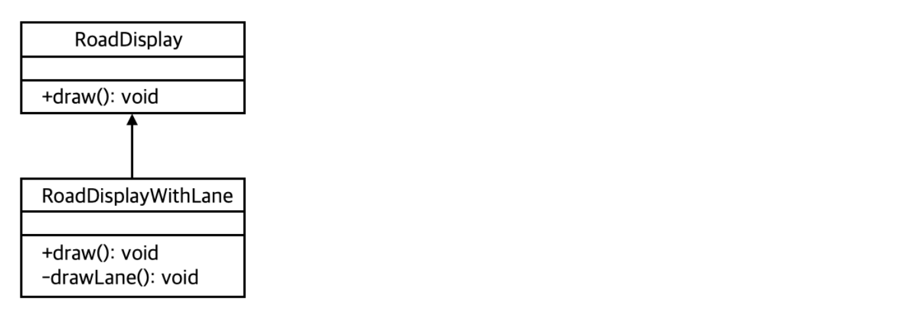
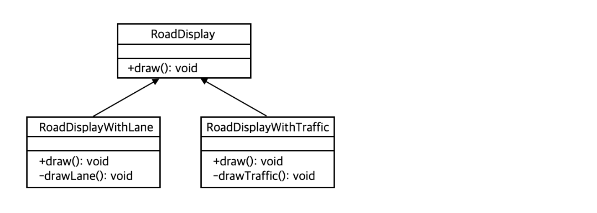
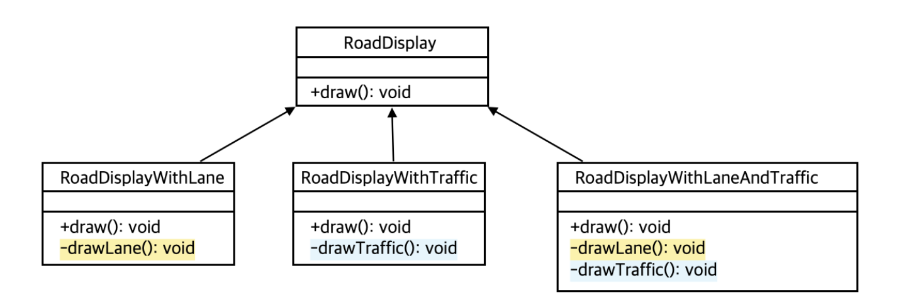
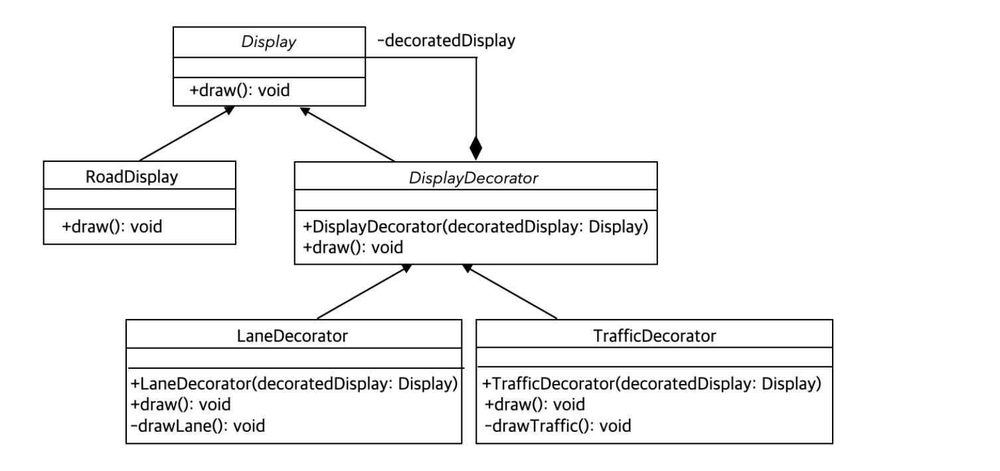
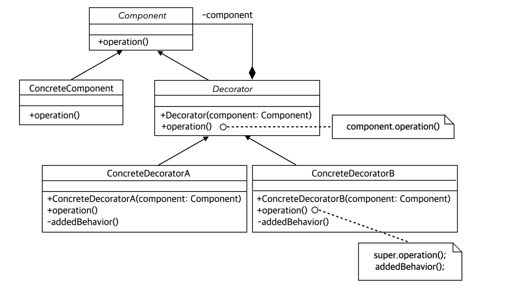
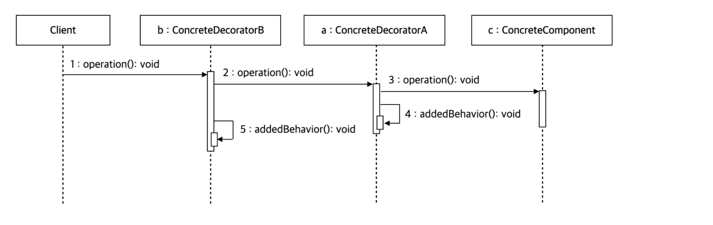

<br/>

### 🥎 도로 표시 방법 조합하기
내비게이션 SW에서 도로 표시 기능과 추가 옵션인 차선 표시 기능 설계

추가 옵션인 차선표시 기능은 RoadDisplay을 상속받아 draw() 메서드를 오버라이드

<br/>

`도로 표시 클래스` - RoadDisplay 

`차선 표시 클래스` - RoadDisplayWithLane extends RoadDisplay



```java
public class RoadDisplay{
	public void draw(){
		System.out.println("기본 도로 표시");
	}
}


public class RoadDisplayWithLane extends RoadDisplay{
	public void draw(){
		super.draw();
		drawLane();
	}

	private void drawLane(){
		System.out.println("차선 도로 표시");
	}
}
```

<br/>

### 🥎 문제점
- 또다른 도로표시 기능을 추가로 구현하고싶다면?
- 여러가지 추가기능을 조합해 사용하고 싶다면?

<br/>

### 🥎 또다른 도로표시 기능 추가 구현

```java
public class RoadDisplayWithTraffic extends RoadDisplay{
	public void draw(){
		super.draw();
		drawTraffic();
	}

	private void drawTraffic(){
		System.out.println("교통량 표시");
	}
}
```

<br/>

### 🥎 여러 추가 기능 조합
도로표시의 `추가적인 기능`을 RoadDisplay 클래스를 상속받는 것은 적절한 설계이나,
여러 조합을 구현할 때 상속을 통한 기능 확장은 조합 별로 하위 클래스를 구현해야 함 

→ `단점` : 중복하여 생성되는 메서드 존재, 추가기능의 부분집합 개수만큼 클래스 생성 필요 (2의 n제곱)

 

```java
public class RoadDisplayWithLaneAndTraffic extends RoadDisplay{
	public void draw(){
		super.draw();
		drawLane();
		drawTraffic();
	}
	private void drawLane(){ //RoadDisplayWithLane 내 drawLane()메서드와 중복
		System.out.println("차선 도로 표시");
	}
	private void drawTraffic(){ //RoadDisplayWithTraffic 내 drawTraffic()메서드와 중복
		System.out.println("교통량 표시");
	}
}
```

<br/>

### 🥎 해결책
추가 기능별로 개별적인 클래스를 설계 → 기능을 조합할 때 클래스의 객체를 이용
추가 기능의 수가 많을수록 효과가 큰 설계 (2의 n제곱 → n+2)

 

기본적으로 제공하는 도로 표시 기능은 RoadDisplay 클래스의 draw 메서드를 호출
따라서 차선 표기와, 교통량 표기 기능은 RoadDisplay 객체 참조가 필요 (draw 메서드 오버라이드)
→ 상위 클래스인 DisplayDecorator 클래스에서 Display 클래스로의 컴포지션 관계를 통해 표현

```java
public abstract class Display{
	public abstract void draw();
}

public abstract class DisplayDecorator extends Display{
	private Display decoratedDisplay;

	public DisplayDecorator(Display decoratedDisplay){
		this.decoratedDisplay = decoratedDisplay;
	}
	public void draw(){
		decoratedDisplay.draw();
	}
}
```

<br/>

**차선표기와 교통량 표기 기능 조합 구현**
```java
public class Client {
	public static void main(String[] args){

		Display roadWithLandAndTraffic = 
			new TrafficDecorator(new LaneDecorator(new RoadDisplay()));

		roadWithLandAndTraffic.draw();

	}
}
```

<br/>

### 🥎 데커레이터 패턴
데커레이터 패턴은 `기본 기능에 추가할 수 있는 기능 종류가 많은 경우` 각 추가 기능을 Decorator 클래스로 정의 한 후 필요한 Decorator 객체를 조합함으로써 추가 기능의 조합을 설계하는 방식
Decorator 객체 조합을 프로그래밍 실행 중 동적으로 생성

```java
public class Client {
	public static void main(String[] args){

		Display road = new RoadDisplay();
		
		for(String decoratorName: args){
			if(decoratorName.equalsIgnoreCase("Lane"))
				road = new LaneDecorator(road);
			if(decoratorName.equalsIgnoreCase("Traffic"))
				road = new TrafficDecorator(road);
			if(decoratorName.equalsIgnoreCase("Crossing"))
				road = new CrossingDecorator(road);
		}
		road.draw();
	}
}
```

<br/>

### 🥎 **데커레이터 패턴의 클래스 다이어그램**

 

- `Component` : 기본 기능의 ConcreteComponent와 추가 기능의 Decorator의 공통 기능을 정의
                       즉, 클라이언트는 Component를 통해 실제 객체를 사용
- `ConcreteComponent` : 기본 기능을 구현하는 클래스
- `Decorator` : 많은 수가 존재하는 구체적인 Decorator의 공통 기능을 제공
- `ConcreteDecoratorA`, `ConcreteDecoratorB` : Decorator의 하위 클래스, 기본 기능에 추가되는 개별 기능


<br/>

### 🥎 **데커레이터 패턴의 순차 다이어그램**

 


<br/>

---
## References

[자바 객체지향 디자인 패턴 (정인상, 채흥석)](http://www.yes24.com/Product/Goods/12501269)

<br/>

---