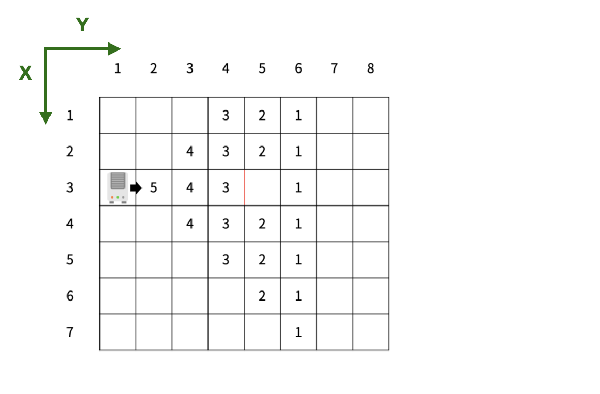

<br/>

### [백준 23289 온풍기 안녕!](https://www.acmicpc.net/problem/23289)

<br/>

### 🥎 구현 과정
1) 온풍기, 대각선, 벽 방향 설정
2) 입력값에 따른 온풍기 방향, 벽 방향 저장
3) 온풍기 작동 구현
4) 온도 조절
5) 온도 체크 - 종료조건

<br/>

### 🥎 0) 문제 분석



<br/>

`Cell` 에 저장되는 정보를 구조체로 구현한다. 

* 주어지는 정보 : 온풍기 유무와 방향, 온도, 벽

<br/>

`heater` : 온풍기 방향 (0이면 온풍기가 없는 칸)

`wall` : 한 칸을 기준으로 상, 하, 좌, 우의 벽을 저장 (🔥 중복해서 벽 존재 가능하기 때문에 vector로 구현)

`degree` : 해당 칸의 온도

<br/>

온풍기의 퍼져나가는 바람은 `queue`를 사용하여 바람이 이동할 칸을 저장, 칸마다 세번씩 탐색한다.

순차적으로 퍼져나가며 3번 탐색해야 하기 때문에 선입선출 자료구조인 `queue`를 사용.

온풍기의 바람이 퍼져나갈 때 온도가 5부터 1까지로 감소하며 이동하기 때문에 

depth를 저장하기 위한 `Wind` 구조체도 선언한다.

```java
struct Cell{
    int heater=0;
    vector<int> wall;
    int degree=0;
};

struct Wind{
    int x;
    int y;
    int depth;
};
```

<br/><br/>


### 🥎 1) 온풍기, 대각선, 벽 방향 설정

문제에서 주어지는 `온풍기 방향`은 다음과 같다.

1: 방향이 오른쪽

2: 방향이 왼쪽

3: 방향이 위

4: 방향이 아래

<br/>

따라서 주어지는 방향에 맞추어 x,y좌표를 움직이는 dx, dy 배열을 설정하려고 한다. 

> int dx[5] = { 0, 0, 0, -1, 1}, dy[5] = { 0, 1, -1, 0, 0};

> 순서 - heater 기준  : 우 좌 상 하

<br/><br/>

다음은 `벽` 방향을 설정하려고 한다.

벽은 두 셀 사이에 존재하므로, 벽 하나를 입력받으면 `양쪽 셀에 벽 정보를 저장`해야 한다.

<br/>


<br/>

온풍기 바람과 벽의 방향이 반대인 경우, 해당 Cell은 바람이 이동하지 않는다.


<br/>

따라서 `온풍기 방향`과 `벽 방향`을 반대 방향으로 구현한다.

⇒ 한 셀에서 `온풍기 방향`, `벽 방향` 값이 같으면 바람의 영향을 받지 않으므로 검증부 구현이 쉬워진다.

<br/>

```java
if(cell.heater == cell.wall) return false;

```


> wall   : 1-좌 2-우 3-하 4-상 

> heater : 1-우 2-좌 3-상 4-하

<br/><br/>


온풍기는 출발 지점을 기준으로 삼각형 꼴로 퍼져나간다.

`온풍기가 퍼지는 방향`을 설정하기 위해 `windDx`, `windDy`을 2차원 배열로 설정했다. 

각 행은 온풍기 바람과 동일하고, 열은 퍼져나가는 방향을 의미한다.

온풍기 방향이 `우측`이 라면 `대각선 상`, `우측`, `대각선 하` 방향으로 온풍기가 퍼져나간다.


<br/>


바람이 대각선으로 이동하는 경우는 두개의 벽을 체크해야한다.

`이동한 좌표에서 체크해야하는 벽`은 기존과 동일하게 온풍기 바람 방향과 반대인지 체크한다.

`기준 좌표에서 체크해야하는 벽`을 확인하기 위해 `wallChk`을 2차원 배열로 설정했다. 


<br/>


<br/><br/>


온풍기 진행 방향별로 퍼져나가는 좌표를 `windDx`, `windDy`에 저장한다.

온풍기 방향이 `우` 라면 `대각선 상`, `우`, `대각선 하` 방향으로 온풍기가 퍼져나간다.


<br/>


<br/>

> int windDx[5][3] = {{0,0,0},{-1,0,1},{-1,0,1},{-1,-1,-1},{1,1,1}}; //순서 - heater 기준  : 우 좌 상 하

> int windDy[5][3] = {{0,0,0},{1,1,1},{-1,-1,-1},{-1,0,1},{-1,0,1}}; //순서 - heater 기준  : 우 좌 상 하

> int wallChk[5][3] = {{0,0,0},{4,2,3},{4,1,3},{1,4,2},{1,3,2}}; //순서 - heater 기준  : 우 좌 상 하

<br/><br/>


### 🥎 2) 입력값에 따른 온풍기 방향, 벽 방향 저장

<br/>

우리는 Cell구조체를 사용해 map에 온풍기방향, 온도, 벽 정보를 저장하려고 한다.

이때 온풍기를 동작시키기 위해서는 온풍기의 위치를 알고있어야 하므로

Cell 구조체의 온풍기 방향과는 별개로 `heaters` 벡터에 리스트를 저장한다.

종료 조건 체크 지점은 `checkList` 벡터에 리스트를 저장한다.

주어지는 벽(가로, 세로)에 따라 온풍기 방향과 반대방향을 저장한다.


```java

//종료조건 체크지점, 온풍기 위치 저장
if(cell == 5) checkList.push_back({i,j});
else if (cell > 0) {
                heaters.push_back({i,j});
                map[i][j].heater = cell;
}

//벽 저장 - 벽이 map 경계와 동일한 경우 방어로직 추가
if(dir == 0){
    if(x-1>=0) map[x-1][y].wall.push_back(3);
    map[x][y].wall.push_back(4);
}else if(dir == 1){
    if(y+1<m) map[x][y+1].wall.push_back(1);
    map[x][y].wall.push_back(2);
}

```
<br/><br/>

### 🥎 3) 온풍기 작동 구현

<br/>

동일한 온풍기는 바람이 중복으로 들어와도 한번만 체크되지만,

다른 온풍기와는 중복 예외 처리하지 않고, 중복해서 더해야 한다.

따라서 온풍기마다 `map`의 복사본인 `windMap`을 할당하여 중복 처리를 구현한다.


```java
vector<vector<Cell>> windMap;
windMap.assign(map.begin(), map.end());

```

<br/>

<br/>

온풍기 작동을 구현하기 위해 queue< Wind >를 선언해 온풍기 시작점을 넣고, 시작 depth는 4로 설정한다.

for문을 3번 돌며 각 Cell마다 세번 퍼져나가도록 bfs를 구현한다.

<br/>

종료조건은 `isExist`함수로 map 범위를 벗어나는지 체크하고,

`canGo`함수를 통해서는 바람이 이동할 수 있는 칸인지 검증한다.

검증 단계에서 바람의 이동 가능 여부는 분석 단계에서 설정한 기준을 적용한다.

* `기준 좌표` : 대각선, 진행방향의 벽 확인
* `이동할 좌표` : 진행방향의 벽 확인

<br/>


<br/>

`canGo`함수에서는 Cell의 좌표와 벽 방향을 받아, Cell의 Wall 리스트에 동일한 벽이 있는지 체크한다.

`dir`은 온풍기의 진행방향을 의미한다.


```java
//map 범위 체크 함수
bool isExist(int x, int y){
    if(x>=0 && x<n && y>=0 && y<m) return true;
    return false;
}

//벽 확인 함수
bool canGo(int x, int y, int wall){
    for(int i=0; i<map[x][y].wall.size(); i++){
        if(map[x][y].wall[i] == wall) return false;
    }
    return true;
}

//bfs 구현
while(!windQueue.empty()){
    int x = windQueue.front().x;
    int y = windQueue.front().y;
    int depth = windQueue.front().depth;
    
    windQueue.pop();
    
    for(int j=0; j<3; j++){
        int nx = x + windDx[dir][j];
        int ny = y + windDy[dir][j];
        
        if(isExist(nx, ny) && canGo(x,y,wallChk[dir][j]) && canGo(nx,ny,dir)){
            if(windMap[nx][ny].degree == map[nx][ny].degree) windMap[nx][ny].degree += depth;
            if(depth-1 > 0) windQueue.push({nx,ny,depth-1});
        }
    }
}

```
<br/><br/>

### 🥎 4) 온도 조절

<br/>

온도조절은 🔥동시에🔥 일어나기 때문에 순차적으로 map에 반영하여 이전 반영 데이터가 나중 데이터에 영향을 끼치면 안된다.

온풍기의 중복 제거 처럼 새로운 map 복사본 controllMap을 선언해 온도를 조절하고 온도조절을 모두 마치고 map에 반영한다.

온도조절은 Cell별로 벽이 없는 상, 하, 좌, 우 인접칸을 비교한다.

기준 Cell보다 인접칸의 온도가 높은 경우, 나에게 + 되므로 `(인접칸 - 기준 칸)/4`를 더해준다.

온도조절을 마친 후 map frame에 위치한 Cell 온도를 1씩 감소시킬 때 

🔥(0,0), (R,0), (0,C), (R,C)를 `중복해서 빼지 않도록` 주의한다🔥

```java
//온도조절
void controllDegree(){
    
    vector<vector<Cell>> controllMap;
    controllMap.assign(map.begin(), map.end());
    for(int i=0; i<n; i++){
        for(int j=0; j<m; j++){
            int sum = 0;
            
            for(int dir = 1; dir<=4; dir++){
                int nx = i + dx[dir];
                int ny = j + dy[dir];
                
                if(isExist(nx, ny) && canGo(nx,ny,dir)) sum+= (map[nx][ny].degree - map[i][j].degree)/4;
                
            }
            controllMap[i][j].degree += sum;
        }
    }
    map.swap(controllMap);
}
//map frame 온도는 1씩 감소
void minusFrame(){
    for(int i=0; i<n; i++){
        for(int j=0; j<m; j++){
            if(i==0||i==n-1||j==0||j==m-1)
                if(map[i][j].degree>0) map[i][j].degree--;
        }
    }
}
```

<br/><br/>


### 🥎 5) 온도 체크 - 종료조건

<br/>

종료 조건은 모든 구현 중 가장 쉬운 파트이다.

모든 온도 조절이 끝난 후, 주어진 좌표의 온도가 K 이상인지 확인한다.

```java
bool isFinished(){
    for(int i=0; i<searchList.size(); i++){
        int x = searchList[i].first;
        int y = searchList[i].second;
        if(map[x][y].degree < k) return false;
    }
    return true;
}
```

<br/>

### 🥎 최종 소스


```java

#include <iostream>
#include <vector>
#include <queue>

using namespace std;

struct Cell{
    int heater=0;
    vector<int> wall;
    int degree=0;
};
struct Wind{
    int x;
    int y;
    int depth;
};

vector<vector<Cell>> map(21,vector<Cell>(21));
vector<pair<int,int>> heaters;
vector<pair<int,int>> checkList;
int n, m,K, answer = 0;
int dx[5] = {0,0,0,-1,1}, dy[5]={0,1,-1,0,0}; //순서 - heater 기준  : 우 좌 상 하
int windDx[5][3] = {{0,0,0},{-1,0,1},{-1,0,1},{-1,-1,-1},{1,1,1}}; //순서 - heater 기준  : 우 좌 상 하
int windDy[5][3] = {{0,0,0},{1,1,1},{-1,-1,-1},{-1,0,1},{-1,0,1}}; //순서 - heater 기준  : 우 좌 상 하

int wallChk[5][3] = {{0,0,0},{4,2,3},{4,1,3},{1,4,2},{1,3,2}}; //순서 - heater 기준  : 우 좌 상 하
// heater : 우1,좌2,상3,하4
// wall   : 좌1,우2,하3,상4

void input(){
    cin >> n >> m >> K;
    int cell;
    for(int i=0; i<n; i++){
        for(int j=0; j<m; j++){
            cin >> cell;
            if(cell == 5) checkList.push_back({i,j});
            else if (cell > 0) {
                heaters.push_back({i,j});
                map[i][j].heater = cell;
            }
        }
    }
    int wallCnt;
    cin >> wallCnt;
    for(int i=0; i<wallCnt; i++){
        int x, y, dir;
        cin >> x >> y >> dir;
        x--;
        y--;
        if(dir == 0){
            if(x-1>=0) map[x-1][y].wall.push_back(3);
            map[x][y].wall.push_back(4);
        }else if(dir == 1){
            if(y+1<m) map[x][y+1].wall.push_back(1);
            map[x][y].wall.push_back(2);
        }
    }
}
bool isExist(int x, int y){
    if(x>=0 && x<n && y>=0 && y<m) return true;
    return false;
}

bool canGo(int x, int y, int wall){
    for(int i=0; i<map[x][y].wall.size(); i++){
        if(map[x][y].wall[i] == wall) return false;
    }
    return true;
}

void runHeater(){
    
    for(int i=0; i<heaters.size(); i++){
        vector<vector<Cell>> windMap;
        windMap.assign(map.begin(), map.end());
        
        
        int hx = heaters[i].first;
        int hy = heaters[i].second;
        int dir = map[hx][hy].heater;
        queue<Wind> windQueue;
        
        int fx = hx + dx[dir];
        int fy = hy + dy[dir];
        
        
        windMap[fx][fy].degree += 5;
        
        
        windQueue.push({fx,fy,4});
        
        while(!windQueue.empty()){
            int x = windQueue.front().x;
            int y = windQueue.front().y;
            int depth = windQueue.front().depth;
            
            windQueue.pop();
            
            for(int j=0; j<3; j++){
                int nx = x + windDx[dir][j];
                int ny = y + windDy[dir][j];
                
                if(isExist(nx, ny) && canGo(x,y,wallChk[dir][j]) && canGo(nx,ny,dir)){
                    if(windMap[nx][ny].degree == map[nx][ny].degree) windMap[nx][ny].degree += depth;
                    if(depth-1 > 0) windQueue.push({nx,ny,depth-1});
                }
            }
        }
        map.swap(windMap);
    }
}

void controllDegree(){
    
    vector<vector<Cell>> controllMap;
    controllMap.assign(map.begin(), map.end());
    for(int i=0; i<n; i++){
        for(int j=0; j<m; j++){
            int sum = 0;
            
            for(int dir = 1; dir<=4; dir++){
                int nx = i + dx[dir];
                int ny = j + dy[dir];
                
                if(isExist(nx, ny) && canGo(nx,ny,dir)) sum+= (map[nx][ny].degree - map[i][j].degree)/4;
                
            }
            controllMap[i][j].degree += sum;
        }
    }
    map.swap(controllMap);
}

void minusFrame(){
    for(int i=0; i<n; i++){
        for(int j=0; j<m; j++){
            if(i==0||i==n-1||j==0||j==m-1)
                if(map[i][j].degree>0) map[i][j].degree--;
        }
    }
}

bool checkFinished(){
    for(int i=0; i<checkList.size(); i++){
        int x = checkList[i].first;
        int y = checkList[i].second;
        
        if(map[x][y].degree < K) return false;
    }
    return true;
}

void solve(){
    bool isFinished = false;
    while(!isFinished && answer<=100){
        runHeater();
        controllDegree();
        minusFrame();
        answer++;
        isFinished = checkFinished();
    }
    cout << answer;
}

int main(){
    input();
    solve();
}

```

<br/>

---