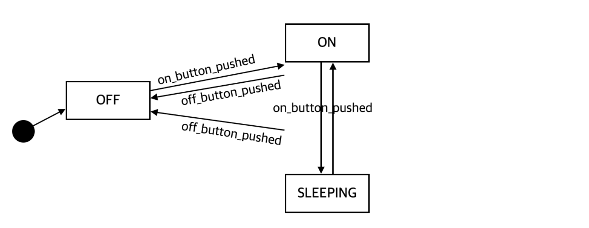
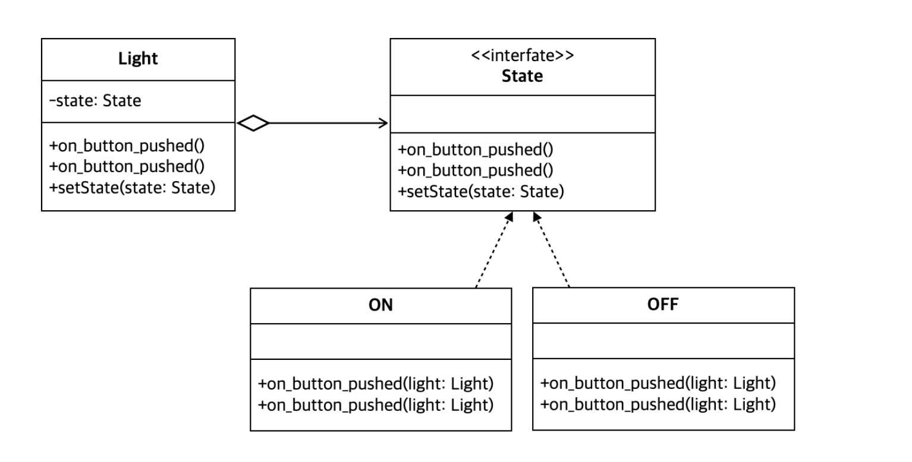

<br/>

### 🥎 상태 머신 다이어그램 (State Machine Diagram)

- UML에서 상태와 `상태변화를 모델링하는 도구`
- 시작 상태 : 검은 동그라미 / 상태 : 모서리가 둥근 사각형 / 상태전이 : 화살표

<br/>

**상태**

- 객체가 시스템에 존재하는 라이프타임 동안 객체가 가질 수 있는 조건이나 상황

<br/>

**시작 상태 : 객체가 시작하는 처음 상태**

- 시작 상태에서의 진입은 객체 생성 또는 명시 X

<br/>

**상태 진입**

- 객체의 한 상태에서 다른 상태로 이동하는 것
- 특정 이벤트 발생 후 명세 조건을 만족한 경우에 이루어짐
- ‘이벤트(인자 리스트)[조건]/액션’으로 명세, ‘/’ 다음에 진입 후 수행되어야 하는 액션 기술


<br/>

---

<br/>

### 🥎 **형광등 만들기**

<br/>

**상태 머신 다이어그램**

상태 : ON, OFF


상태 : ON, OFF, SLEEPING



<br/>

**if-else 조건문으로 구현하는 경우의 문제점**

- 복잡한 조건문으로 상태 변화의 이해 어려움
- 새로운 상태 추가 시 모든 메서드 수정 필요

<br/>

### 🥎 **코드**

<br/>

**Light.java**

```java
public class Light {
	private static int ON = 0;
	private static int OFF = 1;
	private static int SLEEPING = 2;
	private int state;
	
	public Light() {
		state = OFF;
	}
	
	public void on_button_pushed() {
		if(state == ON) {
			System.out.println("Sleeping");
			state = SLEEPING;
		}
		else if (state == SLEEPING) {
			System.out.println("Light on");
			state = ON;
		}
		else {
			System.out.println("Light on");
			state = ON;
		}
	}

	public void off_button_pushed() {
		if(state == OFF) {
			System.out.println("Nothing happened");
		}
		else if (state == SLEEPING) {
			System.out.println("Light off");
			state = OFF;
		}
		else {
			System.out.println("Light off");
			state = OFF;
		}
	}
}

```

<br/>

**Client.java**

```java
public class Client() {
	public static void main(String[] args) {
		Light light = new Light();
		light.off();
		light.on();
		light.off();
	}
}
```

<br/>

---

<br/>

### 🥎 State Pattern

: 상태에 따라 동일한 작업이 다른 방식으로 실행될 때 해당 상태가 작업을 수행하도록 위임하는 디자인 패턴

<br/>

**목표** : 현재 시스템의 `상태,상태 변화에 독립적인 코드 구현`

<br/>

### 🥎 구현
- Context 요소가 어떤 행위를 수행할 때 `상태 클래스가 행위를 수행하도록 위임` ⇒ `시스템의 상태와 무관` 
   이를 위해 시스템의 각 상태를 클래스로 분리해 표현

- 상태 클래스는 `상태 변화마다 새로운 객체를 생성할 필요가 없음` **⇒ 싱글턴 패턴 사용**

- 상태 클래스를 캡슐화 하기 위해 인터페이스를 만들어 각 상태를 나타내는 클래스로 실체화

- 상태 변경은 `상태 스스로 알아서 다음 상태를 결정`

- 경우에 따라서는 상태 변경을 관리하는 클래스를 추가 가능

<br/>




<br/>

**State.java**

```java
interface State {
	public void on_button_pushed(Light light);
	public void off_button_pushed(Light light);
}
```

<br/>

**ON.java**

```java
public class ON implements State {
	private static ON on = new ON();
	private ON() {}

	public static ON getInstance() {
		return on;
	}

	public void on_button_pushed(Light light) {
		System.out.println("Nothing happened");
	}

	public void off_button_pushed(Light light) {
		light.setState(OFF.getInstance());
		System.out.println("Light off");
	}
}
```

<br/>

**OFF.java**

```java
public class OFF implements State {
	private static OFF off = new OFF();
	private OFF() {}

	public static OFF getInstance() {
		return off;
	}

	public void on_button_pushed(Light light) {
		light.setState(ON.getInstance());
		System.out.println("Light on");
	}

	public void off_button_pushed(Light light) {
		System.out.println("Nothing happened");
	}
}
```

<br/>

**Light.java**

```java
public class Light {
	private State state;

	public Light() {
		state = OFF.getInstance();
	}

	public void setState(State state) {
		this.state = state;
	}

	public void on_button_pushed() {
		state.on_button_pushed(this)
	}

	public void off_button_pushed() {
		state.off_button_pushed(this)
	}
}
```

---
## References

[자바 객체지향 디자인 패턴 (정인상, 채흥석)](http://www.yes24.com/Product/Goods/12501269)

<br/>

---